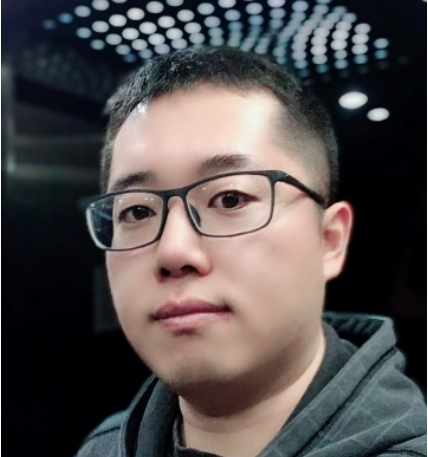

# About Me

My name is Shuai Feng (冯帅). I'm currently an associate professor at the College of Physics in [Hebei Normal University](http://www.hebtu.edu.cn/), China. 

   

## Research Interest

**Galaxy Formation and Evolution**

* Galaxy merge and interaction
* Kinematics of ionized gas

**Integral Field Spectroscopy (IFS) Observation**

## Education

* 2020, Ph.D of Astrophysics, [Shanghai Astronomical Observatory, CAS](http://www.shao.ac.cn/)
* 2013, Visiting Student, [University of Science and Technology of China](https://astro.ustc.edu.cn/)
* 2011, B.S of Physics, [Hebei Normal University](http://www.hebtu.edu.cn/)

## Research Experience

* 2023 - Now, Associate Professor, Hebei Normal University
* 2020 - 2022, Lecturer, Hebei Normal University

## Professional Membership

* 2022 - Now, Chinese Astronomical Society
* 2023 - Now, LAMOST User Committee

## Collaboration

* 2020 - Now, Chinese Space Survey Telescope (CSST)
* 2015 - Now, LAMOST Spectral Survey
* 2015 - 2020, SDSS-IV MaNGA

**[My CV]()**

----
# News

Jul 25, 2023\
 Contributed talk at **2023 Interstellar physics and Chemistry**, Shijiazhuang, Hebei

Jul 20, 2023\
 **Multi-Wavelength Studies of Quasars and Active Galactic Nuclei**, Lijiang, Yunnan

Jul 14, 2023\
 **Member of the LAMOST User Committee**

**[Previous Events](./events)**