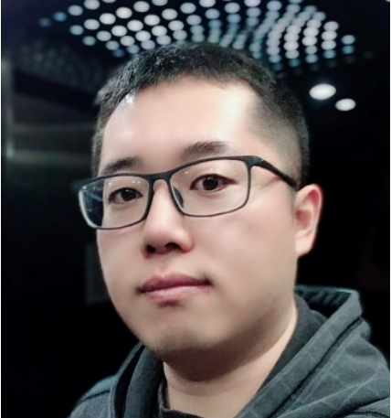

Hi! My name is Shuai Feng (冯帅), an astronomer at [Hebei Normal University](http://www.hebtu.edu.cn/), China. 

## Education

* 2020, Ph.D of Astrophysics, [Shanghai Astronomical Observatory, CAS](http://www.shao.ac.cn/)
* 2013, Visiting Student, [University of Science and Technology of China](https://astro.ustc.edu.cn/)
* 2011, B.S of Physics, [Hebei Normal University](http://www.hebtu.edu.cn/)

## Research Experience

* 2020 - Now, Lecture, Hebei Normal University
