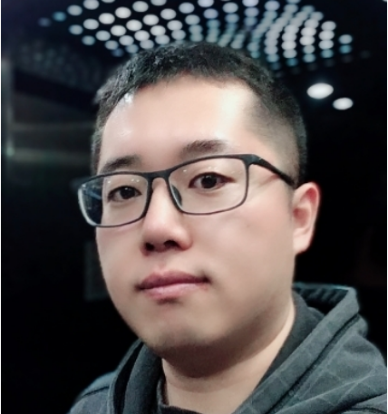

## About Me / 关于我

My name is Shuai Feng (冯帅). I am an associate professor at the College of Physics, [Hebei Normal University](http://www.hebtu.edu.cn/), China.

I received my Ph.D. in Astrophysics from the [Shanghai Astronomical Observatory, Chinese Academy of Sciences](http://www.shao.ac.cn/) in 2020, and my B.S. in Physics from Hebei Normal University in 2011. I joined Hebei Normal University in 2020. A fuller academic profile is available in my [Curriculum Vitae](./cv/).

   

### 🔬 Research Interests / 研究方向

My research focuses on galaxy formation and evolution, combining galaxy surveys, integral field spectroscopy, numerical simulations, and mock observations to study how interactions, gas dynamics, star formation, chemical enrichment, and environment shape galaxies.

Current work focuses on:

* **Galaxy Interactions and Mergers**
* **Gas Kinematics and Gas Cycling**
* **Integral Field Spectroscopy and Mock Observations**

👉 [Research Details](./research/)

### 📘 Teaching / 教学工作

* Undergraduate Courses: Atomic Physics (原子物理学), Optics (光学), Observational Astrophysics (实测天体物理), Experiments in General Physics 1 (普通物理实验一), 
* Graduate Courses: Galactic Astronomy (星系天文学), Reduction Methods for Astronomical Data (天文数据处理)

👉 [Teaching Details](./teaching/)

### 👥 Our Group / 研究团队

Our group welcomes students interested in galaxy evolution, observational astronomy, integral field spectroscopy, and astronomical data analysis.

* Graduate Student: Bingxu Huo (霍柄锡)
* Undergraduate Students: Yijin Niu (牛艺瑾), Weiqi Fan (范炜奇)

*[Join Our Group (加入我们)](./group/)*

----
### 📰 News / 新闻动态

#### ⏳ Upcoming / 近期预告

Aug 17, 2026\
 Contributed talk at **2026 Symposium on Molecular Clouds and Star Formation**

Jul 29, 2026\
 Contributed talk at **2026 Annual Science Conference of the China Space Station Telescope**, Kashgar, Xinjiang

#### ⏮ Past / 往期动态

Jul 18, 2026\
 Contributed talk at **2026 Youth Astronomy Forum of the Chinese Astronomical Society**, Xichang, Sichuan

Jul 09, 2026\
 Contributed talk at **2026 LAMOST User Training Workshop**, Suzhou, Jiangsu

Jun 10, 2026\
 Yijin Niu received university-level funding from the **College Student Innovation Program**

👉 **[Previous News](./news)**