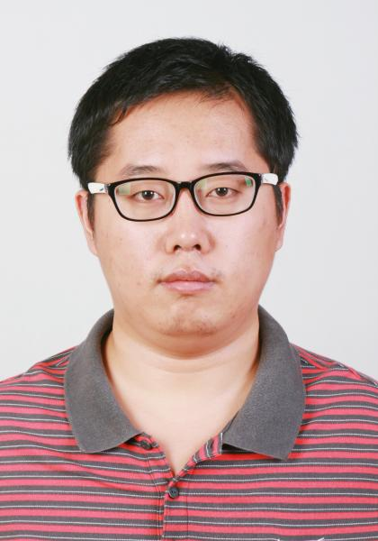

Hi! My name is Shuai Feng (冯帅), an astronomer at [Hebei Normal University](http://www.hebtu.edu.cn/), China. 

## Research

My research is focus on the galaxy formation and evolution. 
- Galaxy interaction, e.g. galaxy pair, galaxy group
- Galaxy kinematics, e.g. morphology of kinematic field
- Star formation, e.g. HII region, young stars

[My ADS]()

## Teaching
- [Optics]()
- [Extra-Galactic Astronomy]()
