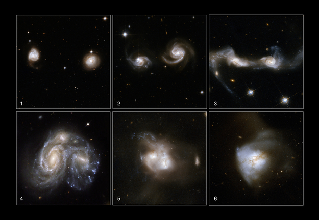

# Research

My research focuses on the **formation and evolution of galaxies**, primarily from an **observational perspective**.  
I study how galaxies interact and merge, how gas is redistributed during these processes, and how such dynamical events regulate star formation and chemical enrichment across cosmic time.

My work is organized around several closely related research directions:

---

## 🌌 SAMSARA（轮回）  
### Sequential Analysis of Merging Systems and Assembly with Recurrent gAs cycling

This project focuses on the **galaxy merger sequence**.  
By studying galaxies at different stages of interaction and merging, I aim to reconstruct their **evolutionary history** and identify the physical processes responsible for:

- morphological transformation,  
- gas inflow and redistribution,  
- enhancement or suppression of star formation.  

Large statistical samples from galaxy surveys are used to trace how these properties evolve along the merger sequence.

---

## 🌊 TUNA（吐纳）  
### Tracing oUtflow and iNflow by Asymmetric velocity fields

This project investigates the **kinematics of ionized gas** in galaxies.  
By analyzing asymmetric velocity fields from integral field spectroscopy, I study how gas inflow, outflow, and dynamical perturbations are connected to galaxy interactions and internal evolution.

These studies provide insights into **gas cycling processes** and their role in regulating star formation and galaxy growth.

---

## 🔭 GEHONG（葛洪）  
### GEnerate tHe data Of iNtegral field spectrograph of Galaxy

This project is dedicated to **integral field spectroscopic analysis and data modeling**.  
I use IFS observations to explore spatially resolved galaxy properties, including star formation, metallicity, and kinematics.

In parallel, I develop numerical tools and simulation pipelines to generate and interpret mock IFS datacubes for large surveys and future missions, such as the **Chinese Space Station Telescope (CSST-IFS)**.

---

## 📄 Publications

[Full Publication List in ADS](https://ui.adsabs.harvard.edu/user/libraries/Q_B15QrhSuyevVM7sqkXPQ)

### Selected Papers
1. **Shuai Feng**, Shiyin Shen, Yanmei Chen, Y. Sophia Dai, Jun Yin, Wenyuan Cui, Mengting Ju, Linlin Li, *The Velocity Map Asymmetry of Ionized Gas in MaNGA II: Correlation between Velocity Map Morphology, Star Formation, and Metallicity in Regular Disk Galaxies*, 2025, **The Astrophysical Journal**, 995, 18  
2. **Shuai Feng**, Shiyin Shen, Fangting Yuan, Wenxin Zhong, Wenyuan Cui, Linlin Li, *Suppression of Star Formation in Galaxy Pairs*, 2024, **The Astrophysical Journal**, 965, 60  
3. **Shuai Feng**, Shiyin Shen, Fangting Yuan, Y. Sophia Dai, Karen L. Masters, *The Velocity Map Asymmetry of Ionized Gas in MaNGA. I. The Catalog and General Properties*, 2022, **The Astrophysical Journal Supplement Series**, 262, 6  
4. **Shuai Feng**, Shiyin Shen, Fangting Yuan, Rogemar A. Riffel, Kaike Pan, *SDSS-IV MaNGA: Kinematic Asymmetry as an Indicator of Galaxy Interaction in Paired Galaxies*, 2020, **The Astrophysical Journal Letters**, 892, 20  
5. **Shuai Feng**, Shiyin Shen, Fangting Yuan, Ali Luo, Jiannan Zhang, Mengxin Wang, Xia Wang, Yinbi Li, *Bivariate Luminosity Function of Galaxy Pairs*, 2019, **The Astrophysical Journal**, 880, 114  