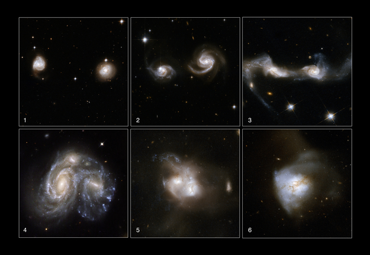
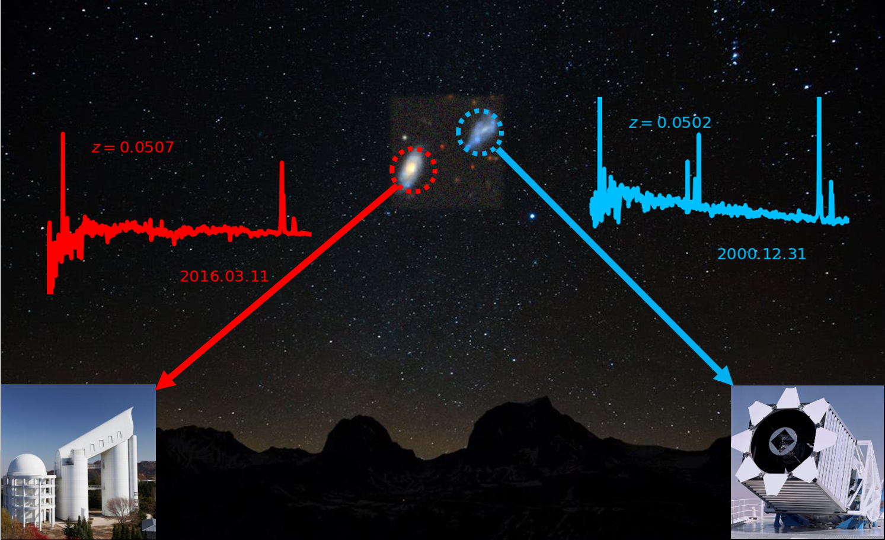

# Research

My research focuses on the **formation and evolution of galaxies** from an **observational perspective**. The central question is how galaxies exchange, redistribute, and consume gas during their evolution, especially when they are affected by interactions and mergers. This question is explored through large galaxy surveys, integral field spectroscopy, multi-wavelength gas observations, and mock observations for future facilities.

The work is organized around three closely connected themes:

---

## Galaxy Interactions and Mergers

Galaxy interactions and mergers are important pathways for galaxy transformation. They can disturb galaxy morphology, reshape internal structures, drive gas inflows, change star formation activity, and alter chemical enrichment. Because these effects are strongly stage-dependent, the key observational challenge is to connect galaxy properties with where a system lies along the merger process, and with the physical timescales over which interaction-driven changes occur.

A large isolated galaxy-pair sample constructed from SDSS and LAMOST spectroscopy provides the statistical basis for this work. With roughly 100,000 galaxies, this sample enables precise measurements of the bivariate luminosity function of galaxy pairs and its dependence on projected separation. These measurements make it possible to describe how the population of paired galaxies changes from wide pairs to close interactions, and to connect pair statistics with merger stage, merger timescale, and the duration of interaction-induced star formation enhancement ([Feng et al. 2019, ApJ](https://ui.adsabs.harvard.edu/abs/2019ApJ...880..114F/abstract)).

Beyond projected separation, the merger sequence can be characterized through two complementary observables: morphology and gas kinematics. On the morphological side, galaxy interactions disturb the original disk structure, producing both changes in internal structure and visible tidal features. The bar fraction is found to decrease significantly at close projected separations, while tidal morphology is closely connected with recent star formation history, revealing how SFR responds as interactions become more advanced ([Li et al. 2026, ApJ](https://ui.adsabs.harvard.edu/abs/2026ApJ..1000..128L/abstract); [Geng et al. 2026, submitted](publication.md)). On the kinematic side, SDSS-IV MaNGA observations show that star formation enhancement appears mainly in galaxy pairs with strongly asymmetric ionized-gas velocity fields, indicating that gas velocity-field morphology can serve as an observational marker of interaction stage ([Feng et al. 2020, ApJL](https://ui.adsabs.harvard.edu/abs/2020ApJ...892L..20F/abstract)). This kinematic classification provides the basis for follow-up CO studies of molecular gas in different merger stages, which show systematic changes in molecular gas content and star formation efficiency along the kinematically defined merger sequence; H I observations add the complementary neutral-gas view of the same interaction-driven gas cycle ([Yu et al. 2022, ApJ](https://ui.adsabs.harvard.edu/abs/2022ApJ...934..114Y/abstract); [Yu et al. 2024, ApJS](https://ui.adsabs.harvard.edu/abs/2024ApJS..273....2Y/abstract)).

The evolution of star formation during mergers is also regulated by the circumgalactic medium. Spiral-elliptical galaxy pairs provide a useful setting for separating tidal perturbation from the gas environment: massive elliptical companions can suppress star formation in their spiral companions, suggesting that hot circumgalactic gas can limit the available gas supply during interactions ([Feng et al. 2024, ApJ](https://ui.adsabs.harvard.edu/abs/2024ApJ...965...60F/abstract)). Spatially resolved measurements of star formation and gas-phase metallicity further show that when hot-CGM regulation and close tidal perturbation act together, enhanced star formation efficiency can become the dominant local response ([Shi et al. 2026, ApJ](https://ui.adsabs.harvard.edu/abs/2026ApJ..1004..115S/abstract)).

Beyond binary galaxy pairs, more complex environments extend the same questions to systems with multiple simultaneous perturbations. Compact galaxy triplets are small but dynamically rich systems, where more than one close companion can shape galaxy morphology, gas redistribution, and subsequent evolution. An isolated compact galaxy triplet was studied as an example of interaction-driven evolution in such a multi-galaxy environment ([Feng et al. 2016, RAA](https://ui.adsabs.harvard.edu/abs/2016RAA....16...72F/abstract)).

---

## Gas Kinematics and Gas Cycling

Gas kinematics provides a direct view of how galaxies redistribute baryons inside their disks. While morphology shows where a galaxy has been disturbed, velocity fields show how gas is actually moving, making integral-field spectroscopy a powerful tool for connecting gas inflow, star formation, and chemical enrichment.

In interacting systems, ionized-gas velocity fields provide direct evidence for the dynamical response of gas to tidal perturbations. In SDSS-IV MaNGA galaxy pairs, enhanced central star formation is found mainly in galaxies with strongly asymmetric gas velocity fields, supporting the picture that interaction-driven gas inflows can feed central starbursts during mergers ([Feng et al. 2020, ApJL](https://ui.adsabs.harvard.edu/abs/2020ApJ...892L..20F/abstract)). This idea was extended to large MaNGA samples through a quantitative framework for ionized-gas velocity-map asymmetry, which shows that mergers and barred spiral galaxies have systematically higher gas velocity-field asymmetry and therefore stronger non-circular gas motions ([Feng et al. 2022, ApJS](https://ui.adsabs.harvard.edu/abs/2022ApJS..262....6F/abstract)).

Non-circular gas motions are not limited to visibly disturbed systems. In apparently regular disk galaxies, the strength of non-rotating gas components is closely related to star formation rate and gas-phase metallicity, providing spatially resolved kinematic evidence that gas accretion or inflow can help trigger star formation and shape chemical enrichment ([Feng et al. 2025, ApJ](https://ui.adsabs.harvard.edu/abs/2025ApJ...995...18F/abstract)). A related direction is to isolate gas-inflow signatures in individual systems, connecting statistical measurements of velocity-field asymmetry with detailed case studies of circumnuclear ionized gas, externally acquired gas, and chemically evolving star-forming galaxies ([Li et al. 2022, ApJ](https://ui.adsabs.harvard.edu/abs/2022ApJ...928..111L/abstract); [Ju et al. 2022, ApJ](https://ui.adsabs.harvard.edu/abs/2022ApJ...938...96J/abstract); [Ju et al. 2025, ApJL](https://ui.adsabs.harvard.edu/abs/2025ApJ...978L..39J/abstract)).

---

## Integral Field Spectroscopy and Mock Observations

Integral field spectroscopy is central to this research because it connects galaxy structure with spatially resolved measurements of emission lines, gas kinematics, metallicity, and stellar populations. For questions involving gas redistribution, star formation, and chemical enrichment, IFS data make it possible to move beyond global galaxy properties and examine where the relevant physical processes take place inside galaxies.

Mock observations extend this IFS approach to future facilities by asking how spatially resolved galaxy properties will be measured under realistic instrumental conditions. For the Chinese Space Station Telescope Integral Field Spectrograph (CSST-IFS), [**GEHONG**](https://csst-ifs-gehong.readthedocs.io/en/latest/) was developed to generate ideal mock datacubes, supporting science preparation, observing-strategy tests, and analysis-pipeline development for future CSST-IFS observations ([Feng et al. 2026, RAA](https://ui.adsabs.harvard.edu/abs/2026RAA....26b4009F/abstract)). This work is part of a broader CSST-IFS simulation effort that provides simulated data products for testing how future observations will recover spatially resolved galaxy properties ([Yan et al. 2026, RAA](https://ui.adsabs.harvard.edu/abs/2026RAA....26b4008Y/abstract)).

The same mock-observation framework also extends to CSST imaging. Simulations for the CSST Multi-Channel Imager and cluster-field mock observations connect instrument performance, survey design, and science applications, helping translate future CSST data products into measurable galaxy and cluster properties ([Yan et al. 2026, RAA](https://ui.adsabs.harvard.edu/abs/2026RAA....26b4006Y/abstract); [Xie et al. 2026, RAA](https://ui.adsabs.harvard.edu/abs/2026RAA....26b4007X/abstract)).

---

## Publications

[Full Publication List](publication.md) · [ADS Library](https://ui.adsabs.harvard.edu/user/libraries/Q_B15QrhSuyevVM7sqkXPQ)

### Selected Papers

1. Cailu Shi, **Shuai Feng**, Shiyin Shen, Linlin Li, Wenyuan Cui, Guozhen Hu, [Radial Distribution of Star Formation and Metallicity in Spiral-Elliptical Galaxy Pairs](https://ui.adsabs.harvard.edu/abs/2026ApJ..1004..115S/abstract), 2026, *The Astrophysical Journal*, 1004, 115
2. Linlin Li, **Shuai Feng**, Shiyin Shen, Qi'an Deng, Ying Zu, Wenyuan Cui, [Reduction of Bar Fraction in Paired Galaxies in the SDSS](https://ui.adsabs.harvard.edu/abs/2026ApJ..1000..128L/abstract), 2026, *The Astrophysical Journal*, 1000, 128
3. **Shuai Feng**, Shiyin Shen, Yanmei Chen, Y. Sophia Dai, Jun Yin, Wenyuan Cui, Mengting Ju, Linlin Li, [The Velocity Map Asymmetry of Ionized Gas in MaNGA II: Correlation between Velocity Map Morphology, Star Formation, and Metallicity in Regular Disk Galaxies](https://ui.adsabs.harvard.edu/abs/2025ApJ...995...18F/abstract), 2025, *The Astrophysical Journal*, 995, 18
4. **Shuai Feng**, Shiyin Shen, Fangting Yuan, Wenxin Zhong, Wenyuan Cui, Linlin Li, [Suppression of Star Formation in Galaxy Pairs](https://ui.adsabs.harvard.edu/abs/2024ApJ...965...60F/abstract), 2024, *The Astrophysical Journal*, 965, 60
5. **Shuai Feng**, Shiyin Shen, Fangting Yuan, Y. Sophia Dai, Karen L. Masters, [The Velocity Map Asymmetry of Ionized Gas in MaNGA. I. The Catalog and General Properties](https://ui.adsabs.harvard.edu/abs/2022ApJS..262....6F/abstract), 2022, *The Astrophysical Journal Supplement Series*, 262, 6
6. **Shuai Feng**, Shiyin Shen, Fangting Yuan, Rogemar A. Riffel, Kaike Pan, [SDSS-IV MaNGA: Kinematic Asymmetry as an Indicator of Galaxy Interaction in Paired Galaxies](https://ui.adsabs.harvard.edu/abs/2020ApJ...892L..20F/abstract), 2020, *The Astrophysical Journal Letters*, 892, 20
