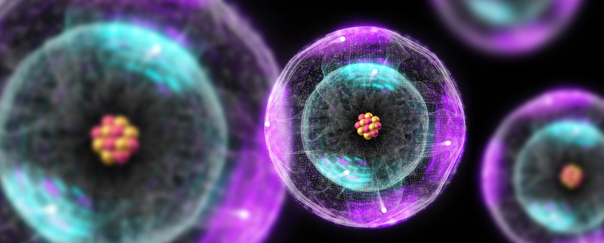

# Atomic Physics（原子物理学）

*2025-2026年秋季学期*

## 参考教材

* **原子物理学**（第五版）, *杨福家*，2019，高等教育出版社
* **原子物理学**，*刘玉鑫*，2024，高等教育出版社
* **原子物理学**（第二版），*崔宏滨*，2012，中国科学技术大学出版社

## 课程安排

时间 | 内容 
---- |----
9.9  | 绪论
9.16 | 原子的位形
9.23 | 原子的位形
9.30 | 原子的量子态
10.7 | 国庆节假期
10.14| 原子的量子态
10.21| 原子的量子态
10.28| 量子力学导论
11.4 | 量子力学导论
11.11| 量子力学导论
11.18| 量子力学导论
11.25| 原子的精细结构
12.2 | 原子的精细结构
12.09| 原子的精细结构
12.16| 多电子原子
12.23| 多电子原子
12.30| 多电子原子
1.6  | X射线

----