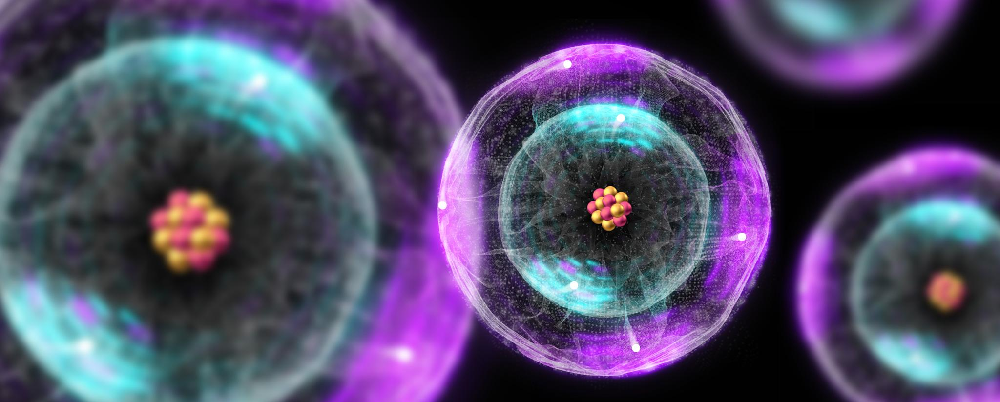

# Atomic Physics（原子物理学）

*2026-2027 学年秋季学期*

## 🧪 课程简介

本课程以原子结构和原子物理为核心，讲解单电子原子、多电子原子、原子的精细结构、原子光谱、X 射线以及原子核物理基础等内容。课程将经典物理图像、早期量子论和量子力学基本思想结合起来，帮助学生理解原子能级、电子态、跃迁选择定则以及光与物质相互作用的基本规律。

通过理论学习、课堂讨论和习题训练，学生将掌握原子物理中的基本概念、典型模型和常用计算方法，并为后续学习量子力学、固体物理、光谱学和近代物理实验等课程打下基础。

## 🎯 学习目标

完成本课程后，学生应能够：

* 理解原子结构、原子能级和电子态的基本物理图像。
* 掌握氢原子、碱金属原子、多电子原子等典型体系的基本处理方法。
* 理解精细结构、塞曼效应、原子光谱和 X 射线的基本物理机制。
* 运用角动量、量子数和选择定则分析简单原子物理问题。
* 建立从经典物理过渡到量子物理的基本认识。

## 📅 上课时间/地点

* 周三3-5节（暂定）
* 裕华校区公教楼A-306

## 📚 参考教材

* **原子物理学**（第五版）, *杨福家*，2019，高等教育出版社
* **原子物理学**（第二版），*崔宏滨*，2012，中国科学技术大学出版社
* **原子物理学**，*刘玉鑫*，2024，高等教育出版社

## 📝 考核方式

本课程考核由平时学习和期末考试共同构成，主要包括：

* 平时作业
* 课堂参与
* 期末考试

具体考核比例以课程大纲和课堂通知为准。

## 📎 课程资料

课堂讲义、习题和补充阅读材料将在课程进行中陆续更新。请同学们及时关注课堂通知。

## 🗓️ 课程安排

时间 | 内容 
---- |----
9.16 | 绪论
9.23 | 原子的位形
9.30 | 原子的位形
10.07 | 原子的量子态
10.14 | 原子的量子态
10.21 | 量子力学导论
10.28 | 量子力学导论
11.04 | 量子力学导论
11.11 | 原子的精细结构
11.18 | 原子的精细结构
11.25 | 原子的精细结构
12.02 | 多电子原子
12.09 | 多电子原子
12.16 | 多电子原子
12.23 | 多电子原子
12.30 | X 射线与原子核物理

----
