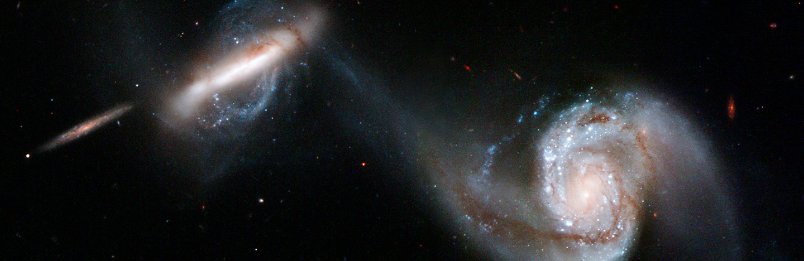

# Galactic Astronomy（星系天文学）

*2022-2023年春季学期*

## 参考教材

* **Galaxies in the Universe: An Introduction**, *Linda S. Sparke & John S. Gallagher, III*
    * 中译本：**宇宙中的星系**, *邹振隆 译*, 中国科学技术出版社
* **Galactic Astronomy**, *James Binney & Michael Merrifield*
    * 中译本：**星系天文学**, *赵刚 译*, 中国科学技术出版社
* **Galaxy Formation and Evolution**, *Houjun Mo, Frank van den Bosch, Simon White*
* **Extragalactic Astronomy and Cosmology: An Introduction**, *Peter Schneider*

## 课程安排

时间 | 内容 | 参考阅读
----|----|----
     | 引言 | 
     | 恒星 |
     | 星际介质 |
     | 银河系（一）|
     | 银河系（二）|
     | 旋涡星系 |
     | 椭圆星系 |
     | 矮星系与不规则星系 |
     | 星系动力学与星系并合 | 
     | 活动星系核 |
     | 星系群与星系团 |
     | 星系的统计规律 |
     | 宇宙大尺度结构与高红移宇宙 |
     | 宇宙学原理与结构的形成 |
     | 暗物质晕 |
     | 恒星形成与反馈 |