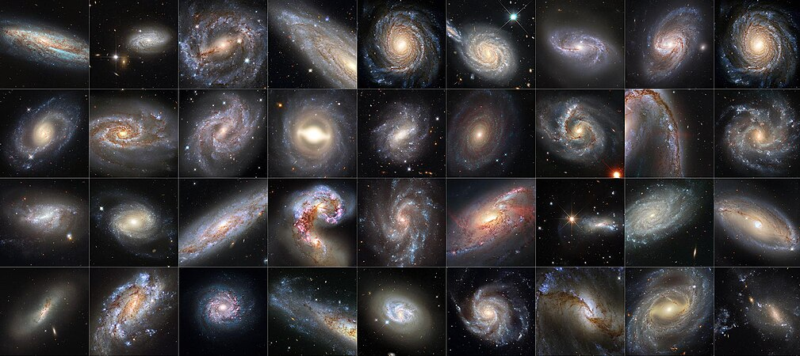

# Galactic Astronomy（星系天文学）

*2025-2026年春季学期*

## 上课时间/地点

* 周二11-13节
* 公教楼D-110

## 参考教材

* **Galaxies in the Universe: An Introduction**, *Linda S. Sparke & John S. Gallagher, III*
    * 中译本：**宇宙中的星系**, *邹振隆 译*, 中国科学技术出版社
* **Galactic Astronomy**, *James Binney & Michael Merrifield*
    * 中译本：**星系天文学**, *赵刚 译*, 中国科学技术出版社
* **Galaxy Formation and Evolution**, *Houjun Mo, Frank van den Bosch, Simon White*
* **Extragalactic Astronomy and Cosmology: An Introduction**, *Peter Schneider*

## 课程安排

时间 | 内容 
----|----
2.21 | 绪论
2.28 | 恒星
3.7  | 星际介质
3.14 | 银河系（一）
3.21 | 银河系（二）
3.28 | 旋涡星系
4.4  | 清明节假期
4.11 | 椭圆星系
4.18 | 校运动会
4.25 | 矮星系与不规则星系
5.2  | 劳动节假期
5.9  | 星系动力学
5.16 | 活动星系核
5.23 | 星系群与星系团
5.30 | 星系的统计规律
6.6  | 宇宙大尺度结构

----

[**拓展阅读**](GalaxyRef.md)