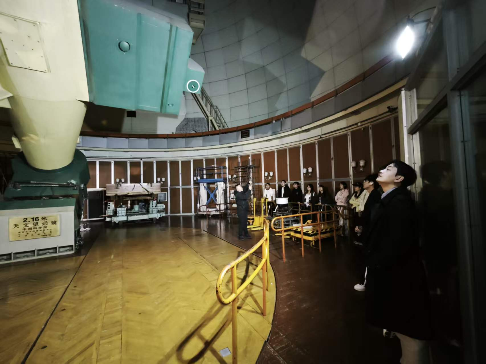
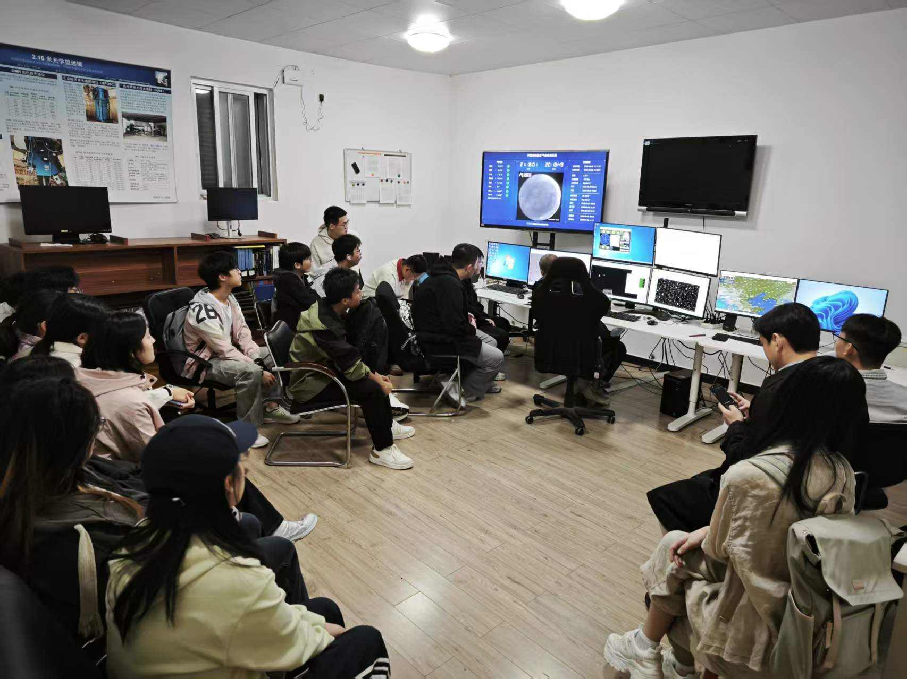
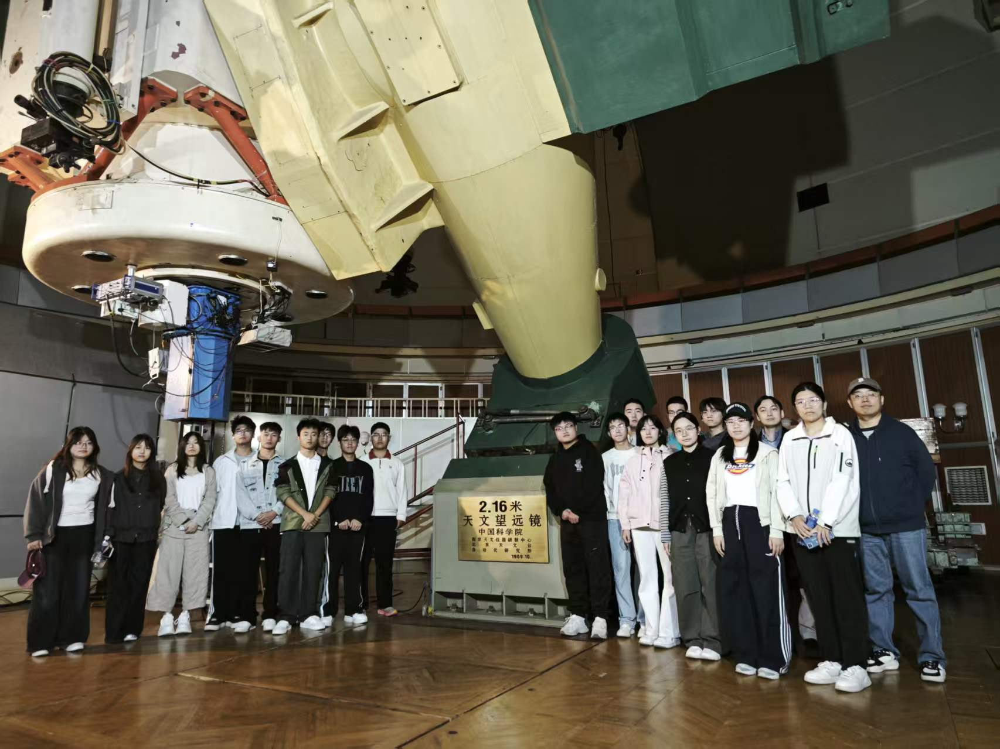
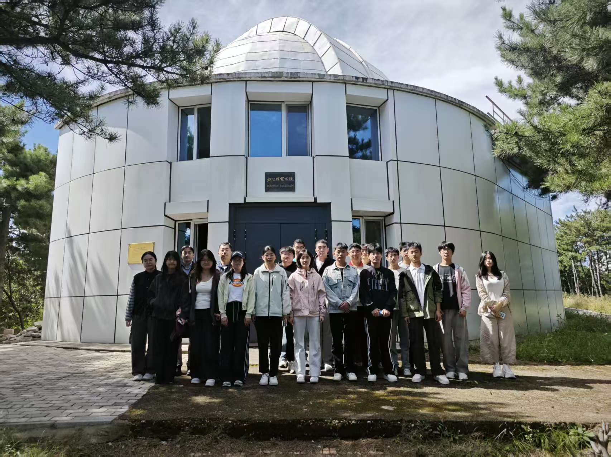
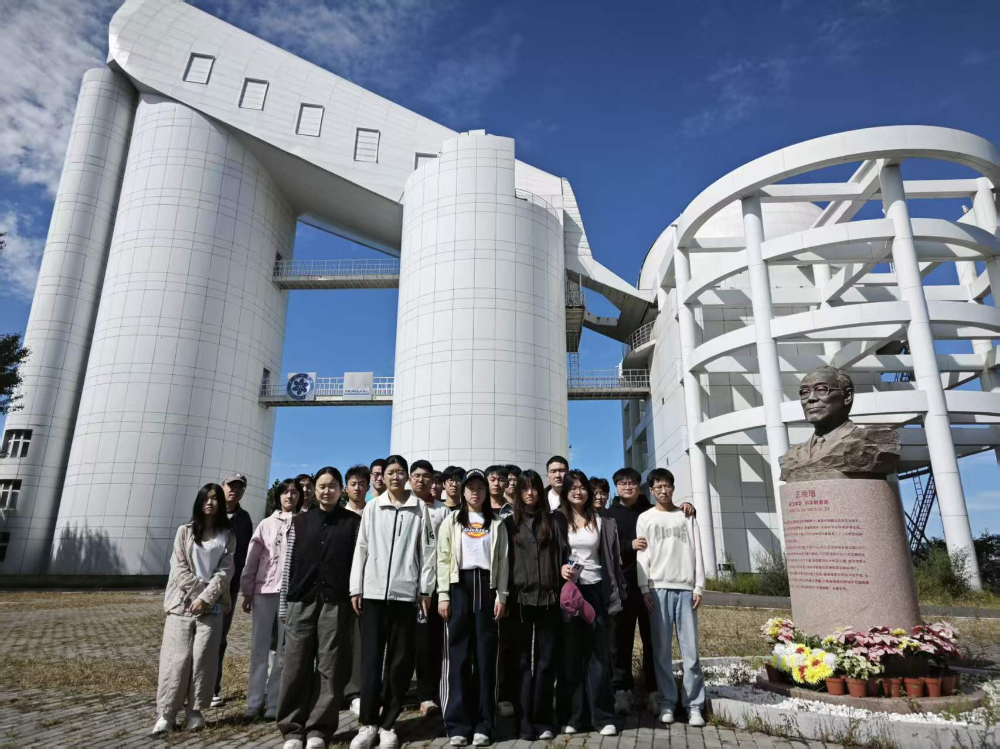
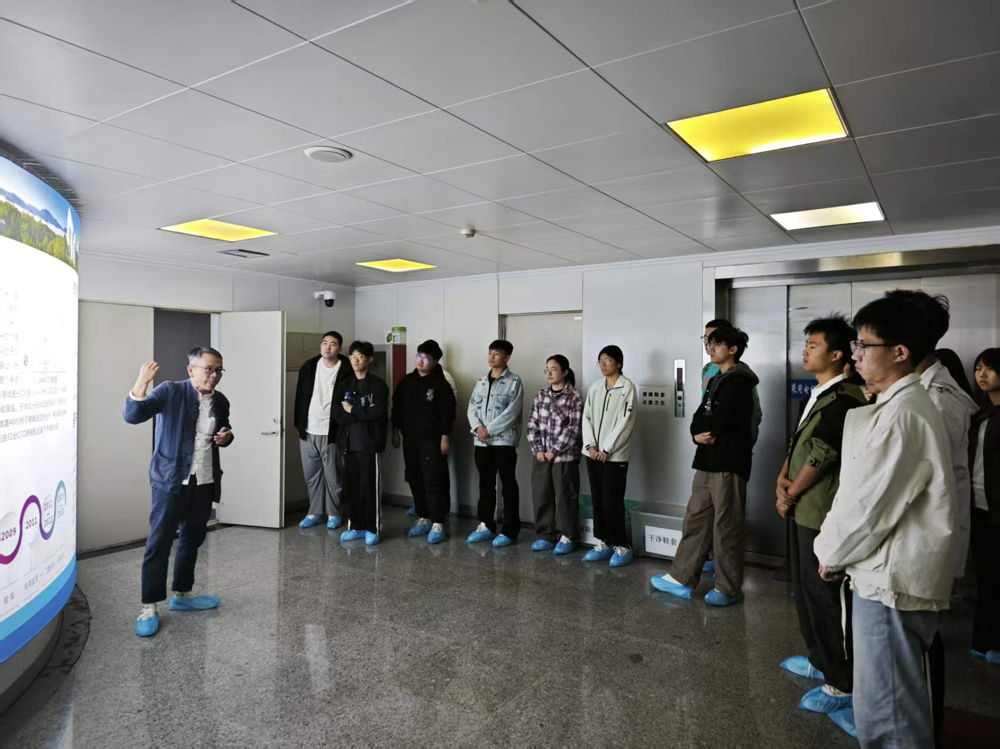

# Observational Astronomy Practice / 实测天体物理实习

**2026 年秋季学期**
**地点**: 国家天文台兴隆观测站 (Xinglong Observatory, NAOC)
**指导教师**: 冯帅 · 罗佳伟

## 实习简介

实测天体物理实习带领学生走进国家天文台兴隆观测站,实地认识大型天文观测设备及其运行。实习期间,同学们参观了 **2.16 米望远镜**、**郭守敬望远镜(LAMOST)** 与 **施密特望远镜**,了解了望远镜的仪器构造、观测流程与数据处理环境,把课堂上的实测天体物理知识带到了观测一线。

## 现场图片 (2026 年 9 月)

<figure>
  
  <figcaption>参观 2.16 米望远镜仪器构造</figcaption>
</figure>

<figure>
  
  <figcaption>2.16 米望远镜观测过程参观</figcaption>
</figure>

<figure>
  
  <figcaption>与 2.16 米望远镜合影</figcaption>
</figure>

<figure>
  
  <figcaption>施密特望远镜前合影</figcaption>
</figure>

<figure>
  
  <figcaption>与郭守敬望远镜(LAMOST)合影</figcaption>
</figure>

<figure>
  
  <figcaption>参观郭守敬望远镜内部结构</figcaption>
</figure>
