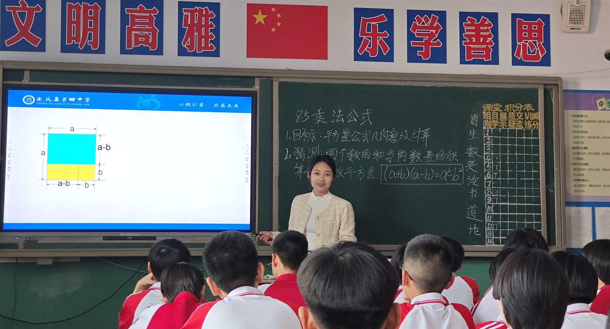
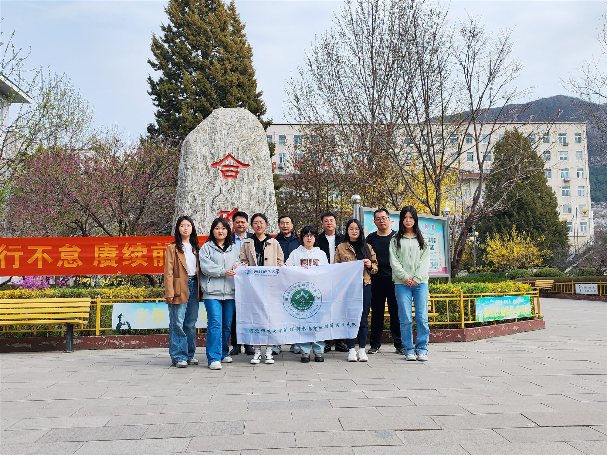
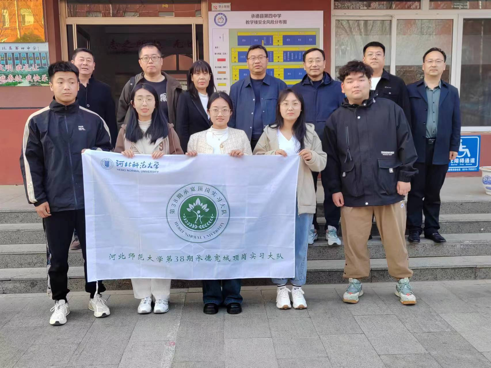
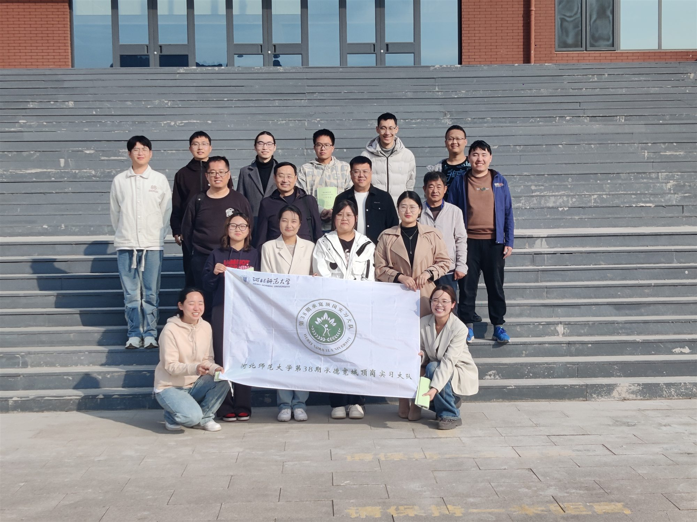
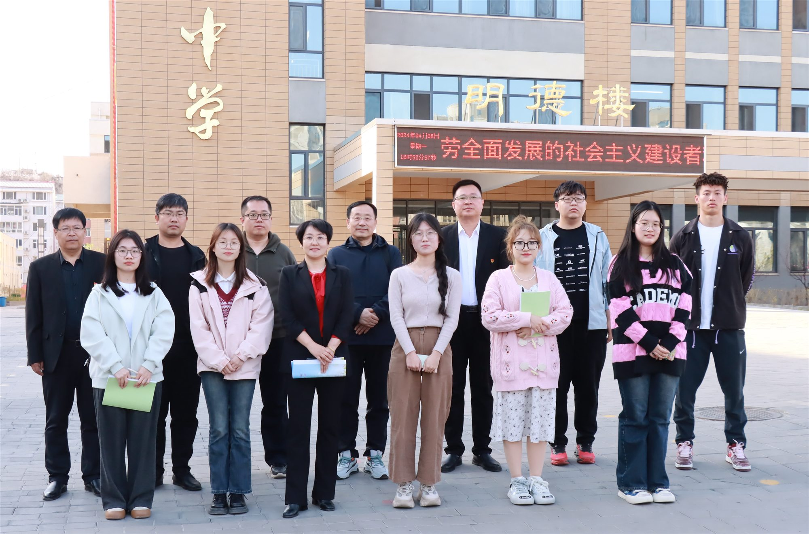
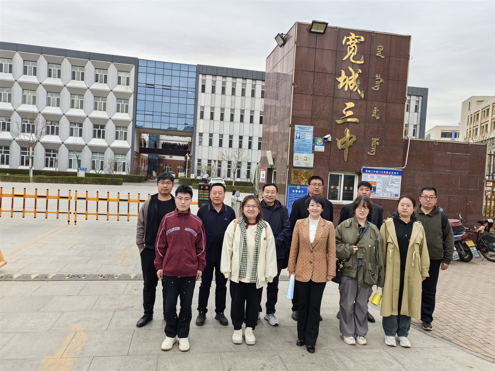
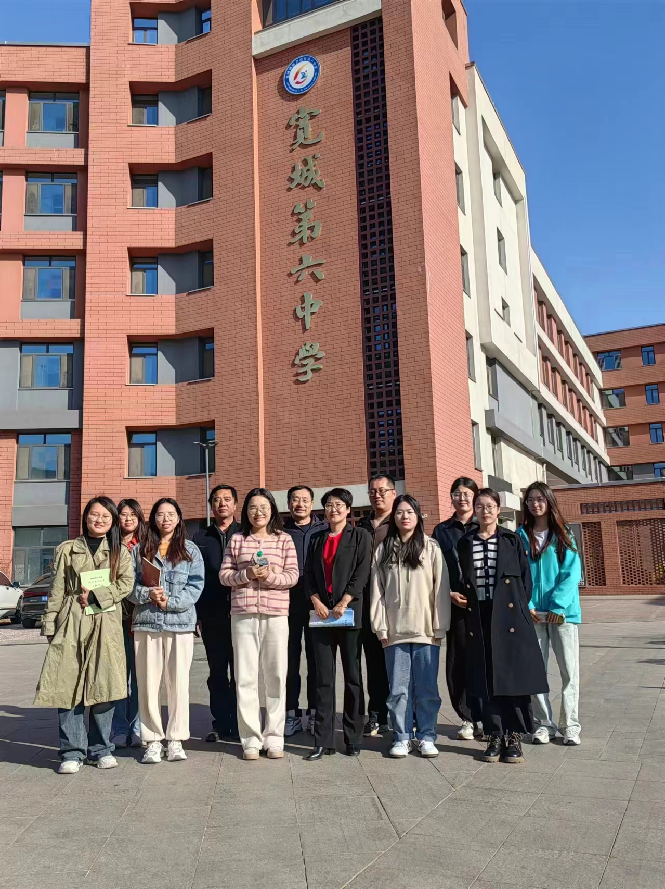
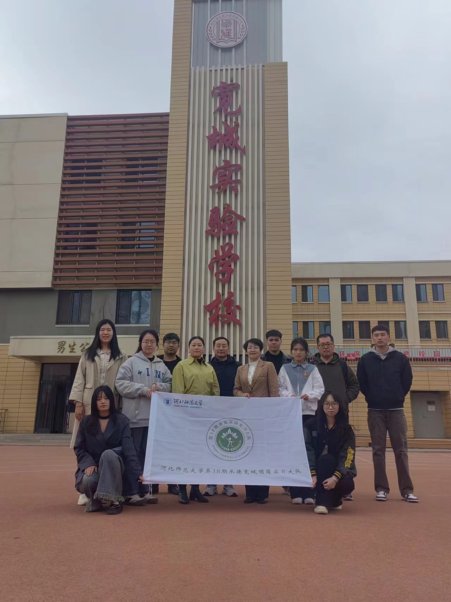
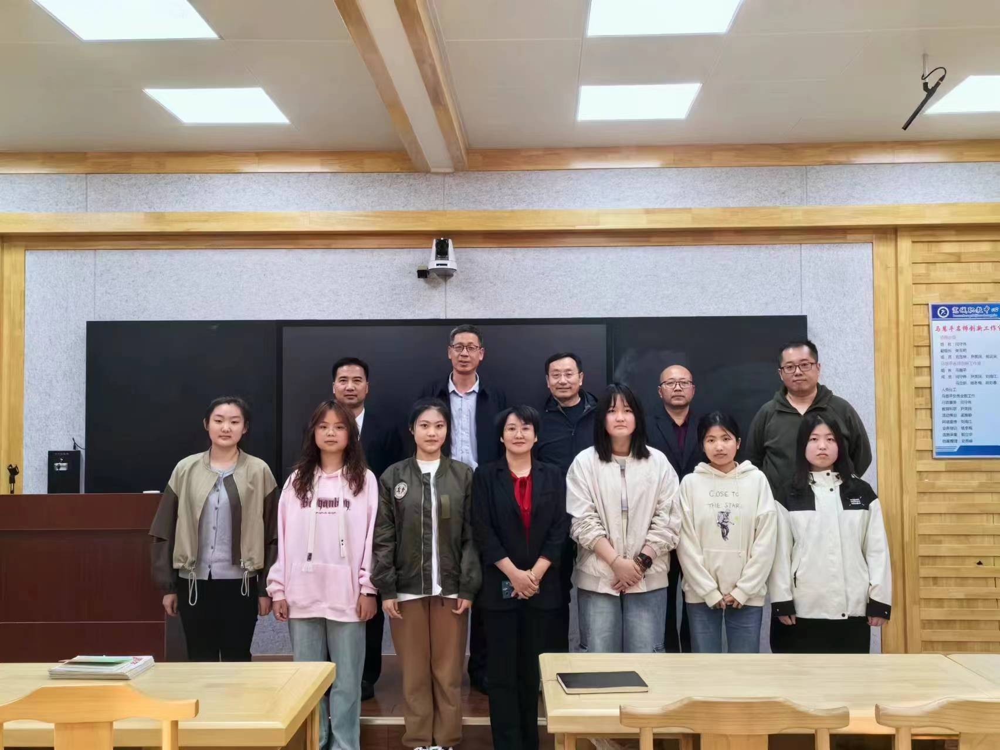

## On-post Teaching Practice / 顶岗实习支教

*2023–2024 学年春季学期 · 承德区域*

---

### 📝 实习简介

顶岗实习支教是河北师范大学教师教育的重要实践环节。学校自 2006 年起系统开展这项工作，组织经过教师教育课程学习、岗前培训和资格考核的高年级师范生，赴中小学、幼儿园进行为期一个学期的全职教师岗位锻炼。

不同于短期见习，实习生以准教师的身份走进真实的学校教育场景，在当地教育部门、实习学校与河北师范大学的协同指导下，参与课堂教学、班级管理、学生指导、教研活动和教育调查。这个过程让师范生把学科知识与教育理论落实到备课、授课、听评课和教学反思之中，在实践中理解教师的专业责任，提升教学实践、综合育人、沟通协作与教育研究能力。

顶岗实习支教不仅是师范生培养的一部分，也承担着服务地方教育的功能。实习生进入县域和乡村学校，充实一线教学力量，为当地学校带来新的课程资源与教学思路；高校、地方教育部门和实习学校以此建立长期协作，在联合培养师范生的同时，开展教师培训、教学研讨和资源共享。师范生的专业成长与基层学校的发展由此相互连接，形成高校教师教育与地方基础教育之间的良性互动，为促进城乡教育资源交流、服务区域教育发展提供持续支持。

> 相关资料：[河北师范大学顶岗实习支教管理办法](https://mayuan.hebtu.edu.cn/a/2022/08/24/D84E59BC1A4C4083B5957AD3E738AD50.html) · [河北师范大学顶岗实习工作介绍](https://zsjyc.hebtu.edu.cn/zsw/a/2017/07/13/909084EB564F485799E88822A33BD5BD.html)

### 🎯 实践内容

- **课堂教学**：钻研课程标准与教材，完成备课、试讲、授课、作业批改和课后反思。
- **班级管理与综合育人**：参与班主任工作、主题班会、学生辅导及校园活动，关注学生的全面成长。
- **听评课与教研**：走进指导教师和同伴课堂，通过集体备课、听课、评课和专题研讨持续改进教学。
- **教育调查与专业反思**：观察真实学情和学校运行，围绕教育教学问题开展调查研究，记录个人专业成长。

### 📷 实践活动留影

2024 年春，承德区域顶岗实习支教记录。

#### 实习分队合影

承德县、宽城满族自治县各实习学校分队留影。

##### 承德市承德县

*承德县第二中学实习分队*

*承德县第四中学实习分队*

*承德县职教中心实习分队*

##### 承德市宽城满族自治县

*宽城满族自治县第二满族中学实习分队*

*宽城满族自治县第三中学实习分队*

*宽城满族自治县第六中学实习分队*

*宽城满族自治县实验学校实习分队*

*宽城职教中心实习分队*

<!--
收到课堂教学照片后，可取消下面内容的注释并按需增删。建议将照片放入 ./image/，
按 teach-01.jpg、teach-02.jpg……命名，并把图注改为学校、课程或活动的真实信息。

#### 课堂教学

*实习生开展课堂教学*

*课堂互动与学生指导*
-->

<!--
收到教研活动照片后，可取消下面内容的注释并按需增删。建议将照片放入 ./image/，
按 research-01.jpg、research-02.jpg……命名，并把图注改为活动的真实信息。

#### 教研活动

*实习生与指导教师开展集体备课*

*听课、评课与教学研讨*
-->
