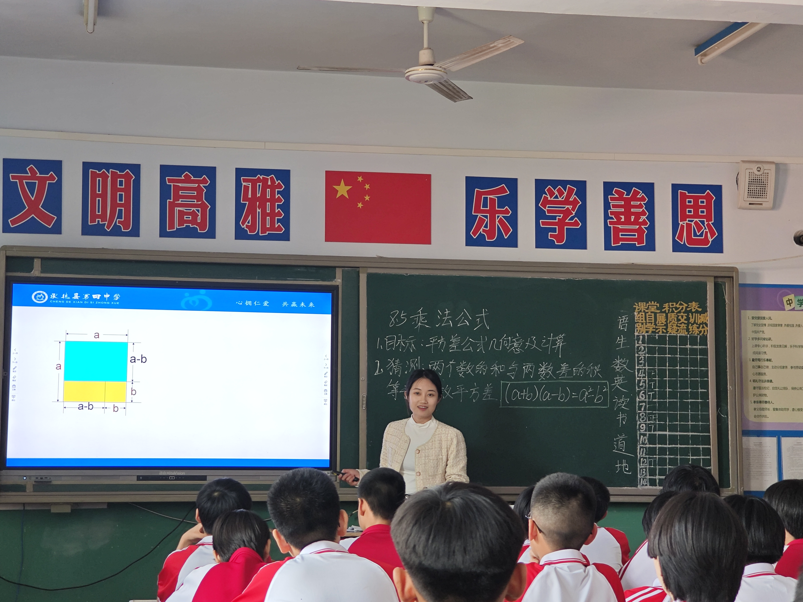
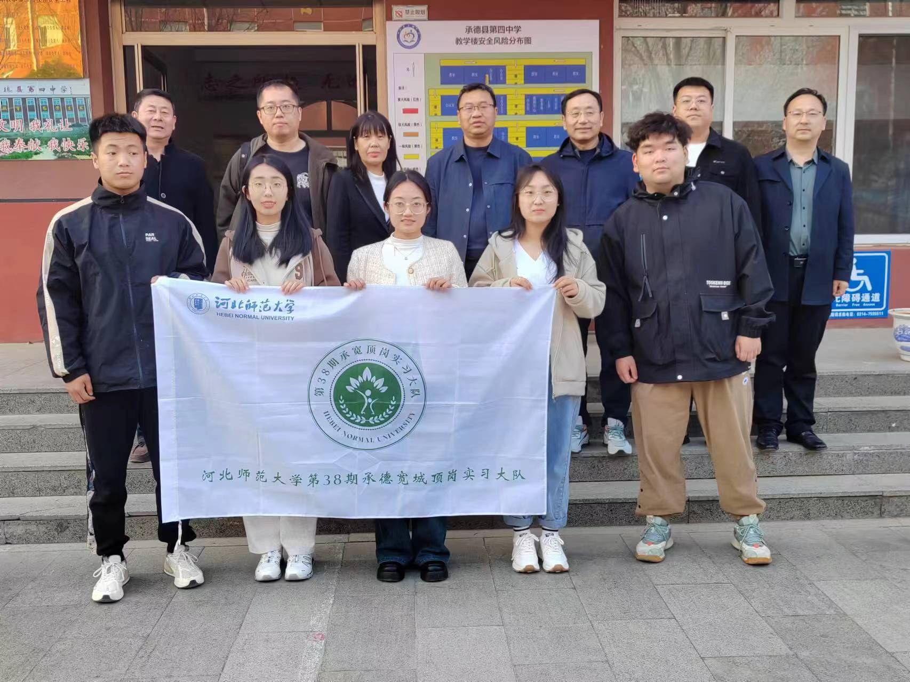
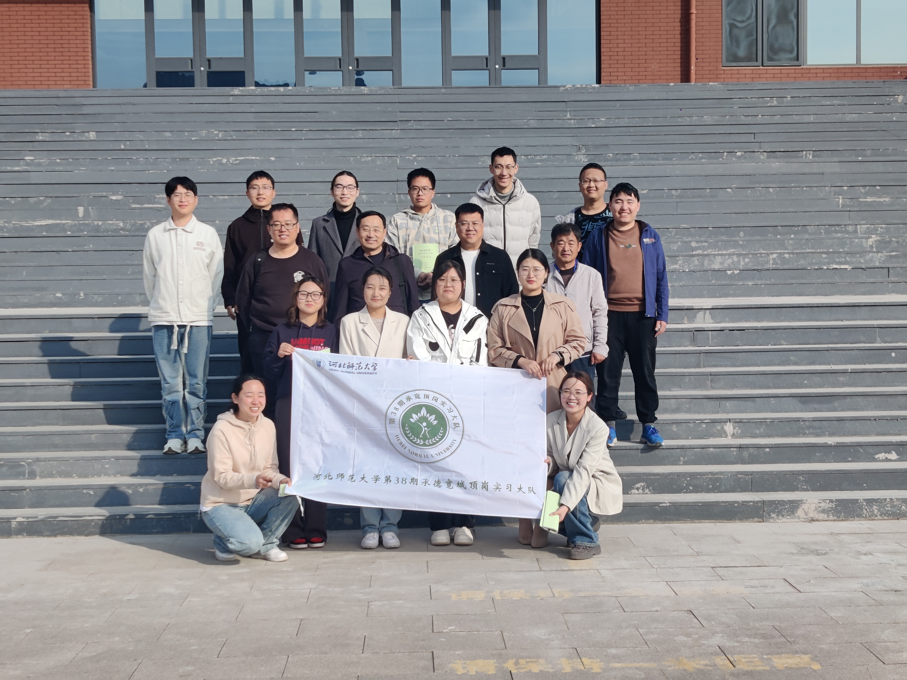
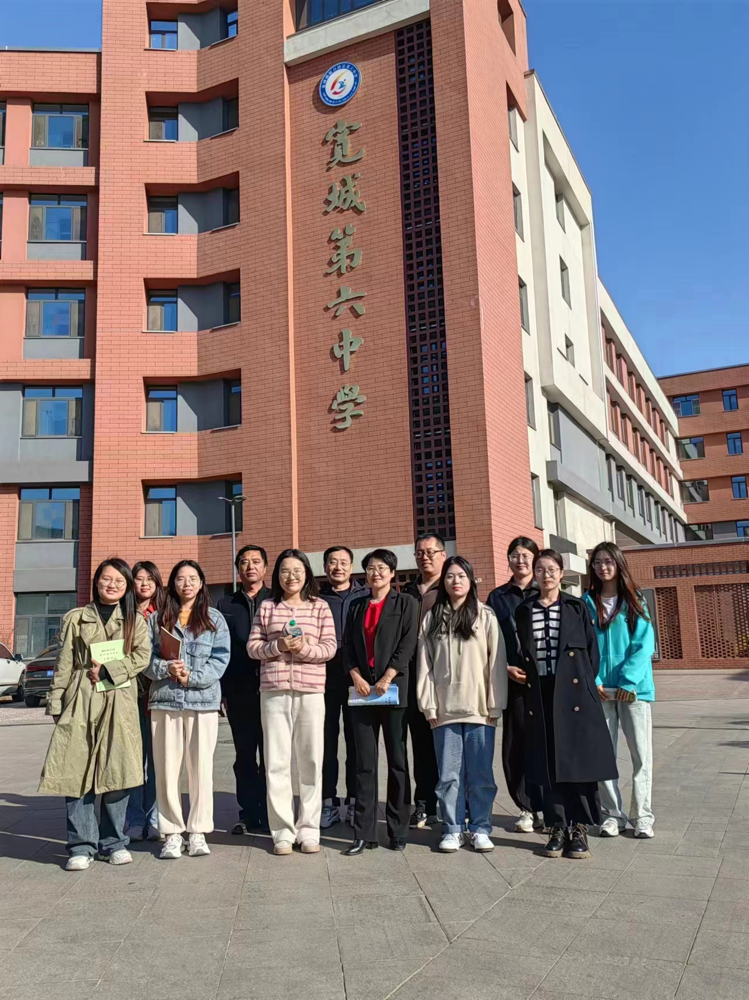
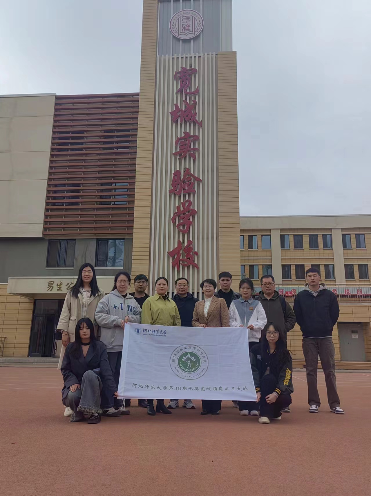
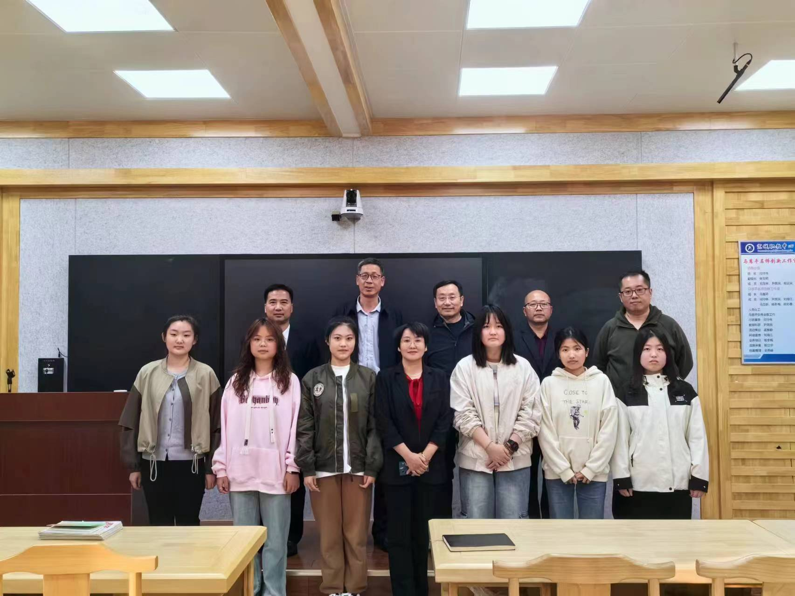

# On-post Teaching Practice (顶岗实习)

*2023-2024年春季学期*

----

河北师范大学的顶岗实习旨在提升师范生的实践能力和教学经验，通常安排在大三，持续一个学期。实习地点主要是河北省内的中小学，尤其是偏远和农村地区。学生在实习期间进行课堂教学、班级管理和教研活动，并接受学校和指导教师的监督与评估，以便更好地适应未来的教师职业。

[河北师范大学顶岗支教指导中心](http://dgsxb.hebtu.edu.cn/)

## 实习学校

### 承德市承德县

##### 承德县第二中学

##### 承德县第四中学

##### 承德县职教中心

### 承德市宽城满族自治县

##### 宽城满族自治县第二满族中学

##### 宽城满族自治县第三中学

##### 宽城满族自治县第六中学

##### 宽城满族自治县实验学校

##### 宽城职教中心

